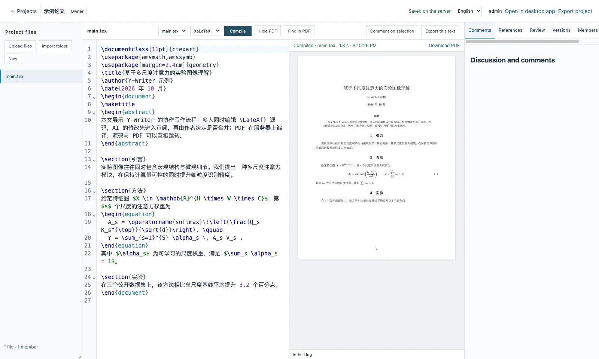
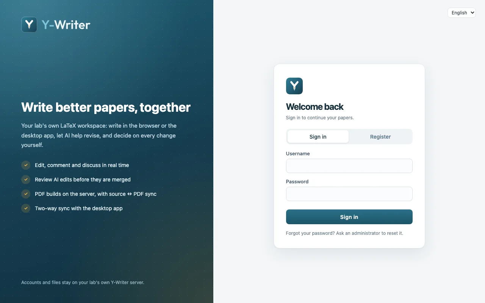
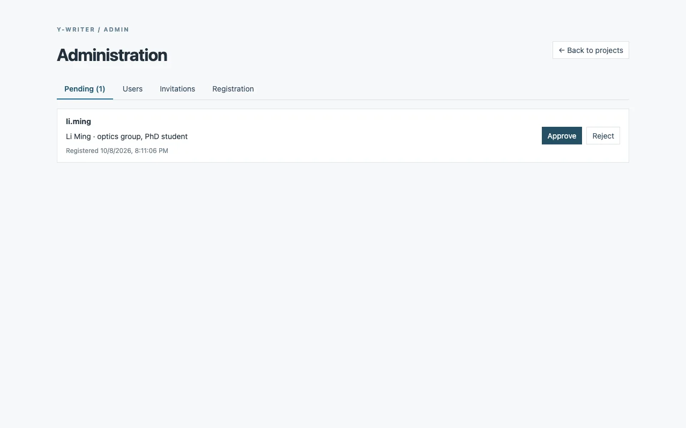

<div align="center">

<picture>
  <source media="(prefers-color-scheme: dark)" srcset="imgs/logo-dark.svg">
  <source media="(prefers-color-scheme: light)" srcset="imgs/logo-light.svg">
  
</picture>

**A LaTeX writing workspace for research groups: write with AI agents on your desktop, collaborate in real time on your lab's own server.**

[](LICENSE)
[](https://tauri.app/)
[](https://nodejs.org/)
[](https://www.postgresql.org/)

English | [中文](README_zh.md)

</div>

---

Y-Writer has two parts that work together:

- **Desktop app** (macOS, Windows): a local-first LaTeX editor where Codex, Claude Code and OpenCode edit your project directly, and every AI change can be reviewed before you keep it.
- **Collaboration server** (web): your group's own Overleaf-style service, with real-time co-editing, comments, server-side PDF builds, shared AI tasks and account approval — deployed on a lab machine you control.

Projects can live on both: the desktop app keeps a local folder in two-way sync with a server project.

<div align="center">

</div>

## Features

### Desktop app

- **Write with AI agents** — Codex, Claude Code and OpenCode side by side, several conversations at once, delegation between them, and PDF or source annotations sent to an agent as tasks.
- **Review AI edits** — every agent turn is recorded; accept, reject or undo each change, with real overlaps sent to a merge panel instead of overwriting you.
- **LaTeX that just builds** — build targets, templates, missing-TeX detection, SyncTeX between source and PDF, XeLaTeX/LuaLaTeX for Chinese and other Unicode text.
- **Safe saving** — recovery drafts, three-way merges with outside changes, and automatic Git versions.
- **Several windows**, one project each (Dock menu / File → New Window on macOS).
- **Chinese and English** interface, following the system language.

### Collaboration server

- **Real-time co-editing** (Yjs) with cursors, comments and replies, versions and comparisons, and a shared bibliography.
- **PDF builds on the server** with error locations and source ↔ PDF jumps.
- **Desktop sync** — open a server project in the desktop app as a local folder; edits flow both ways, conflicts become copies instead of lost work.
- **Shared AI tasks** — a lab machine with Codex or OpenCode signed in runs tasks for every project; results arrive as proposals to review.
- **Accounts for a group** — people register and an administrator approves them; invitation links, an admin console, and per-project roles (owner, editor, commenter, viewer).
- **Runs on your hardware** — PostgreSQL with daily backups; Docker, or natively on a Windows lab PC.

<div align="center">
<table>
<tr>
<td></td>
<td></td>
</tr>
<tr>
<td align="center">Sign in or register</td>
<td align="center">Approve new members</td>
</tr>
</table>
</div>

## Getting started

Requirements: Node.js 24, the pnpm version pinned in `package.json`, and Rust (for the desktop app).

```bash
git clone https://github.com/DingyangLyu/lmms-lab-writer.git
cd lmms-lab-writer
pnpm install
```

**Desktop app**

```bash
pnpm tauri:dev      # development
pnpm tauri:build    # installers for this platform
```

**Collaboration server** (local trial with the embedded database)

```bash
cp apps/collaboration/.env.example apps/collaboration/.env   # set WRITER_ADMIN_PASSWORD (12+ characters)
pnpm --filter @lmms-lab/writer-collaboration build
pnpm --filter @lmms-lab/writer-collaboration start           # http://127.0.0.1:8787
```

For a group, use PostgreSQL and one of the deployment guides below.

## Documentation

| Topic | Guide |
| --- | --- |
| Lab deployment on a Windows PC (no Docker) | [docs/deploy-windows-lan.md](docs/deploy-windows-lan.md) |
| Public HTTPS deployment with Docker and Caddy | [docs/deploy-windows.md](docs/deploy-windows.md) |
| Bibliography, change review, collaboration server, runners | [docs/research-tools-and-collaboration.md](docs/research-tools-and-collaboration.md) |
| Architecture, commands and conventions | [docs/dev.md](docs/dev.md) |

## Project layout

```
apps/desktop          Tauri v2 desktop app (Next.js frontend, Rust backend)
apps/collaboration    Collaboration server and web editor (Node, PostgreSQL, React, Yjs)
packages/sync         Folder ↔ server sync engine used by the desktop app
packages/writing      Three-way merge, review hunks, bibliography
packages/latex-editor CodeMirror LaTeX grammar and folding
packages/i18n         Chinese/English text for both apps
```

## License

Covered original fork contributions use the [DingyangLyu Writer Noncommercial License v1.0](LICENSE): personal, noncommercial teaching and research use is free; commercial use requires prior written authorization. This is not an OSI-approved open-source license.

Y-Writer is built on [LMMs-Lab Writer](https://github.com/EvolvingLMMs-Lab/lmms-lab-writer) by LMMs-Lab. The [upstream MIT license](LICENSES/MIT-LMMs-Lab.txt) and attribution are preserved; upstream websites, downloads and Homebrew packages refer to the upstream product, not to this fork. This fork snapshot was reissued on 2026-10-03 with reconstructed public history; this does not revoke independently granted rights. See [NOTICE](NOTICE) and the [licensing guide](docs/licensing.md). Contact [DingyangLyu](https://github.com/DingyangLyu) for commercial authorization.

The Y-Writer wordmark is set in [Outfit](https://github.com/Outfitio/Outfit-Fonts) (SIL Open Font License 1.1).
