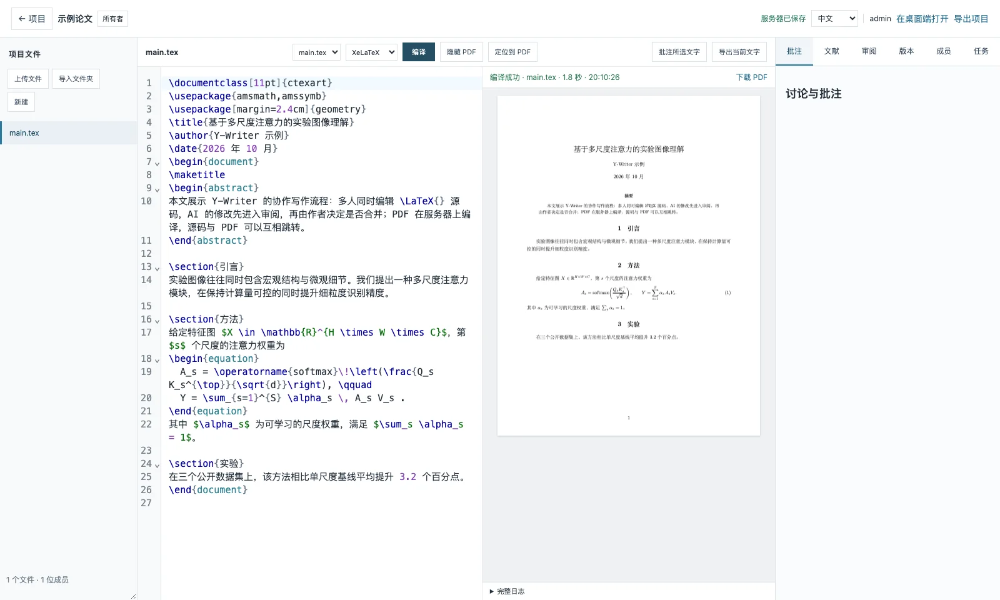
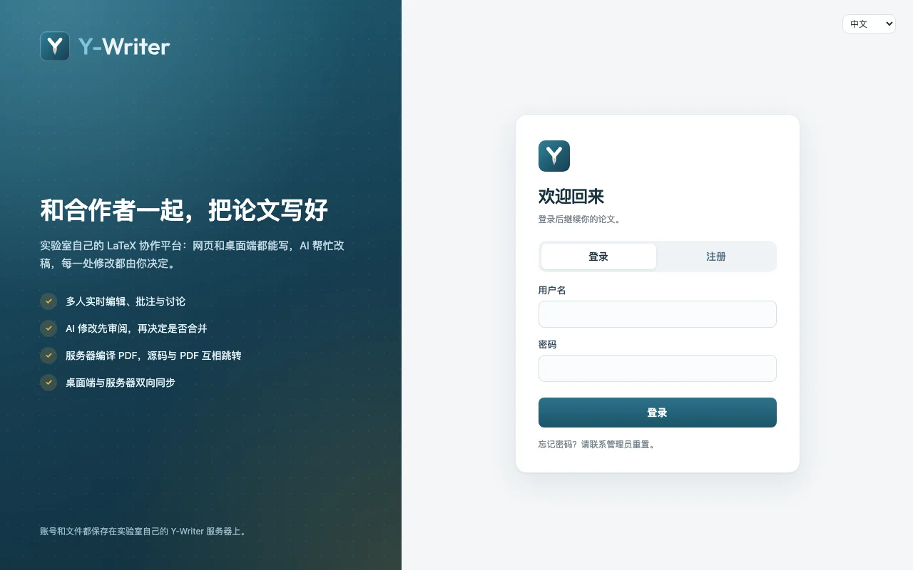
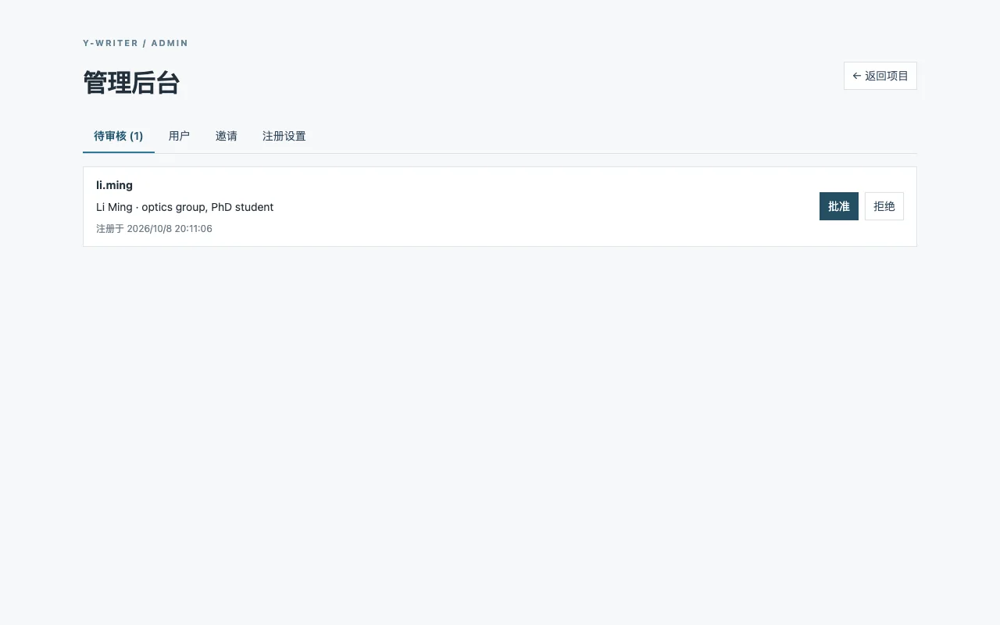

<div align="center">

<picture>
  <source media="(prefers-color-scheme: dark)" srcset="imgs/logo-dark.svg">
  <source media="(prefers-color-scheme: light)" srcset="imgs/logo-light.svg">
  
</picture>

**为课题组准备的 LaTeX 写作平台：在桌面端和 AI 一起写，在实验室自己的服务器上多人实时协作。**

[](LICENSE)
[](https://tauri.app/)
[](https://nodejs.org/)
[](https://www.postgresql.org/)

[English](README.md) | 中文

</div>

---

Y-Writer 由两部分组成，可以配合使用：

- **桌面端**（macOS、Windows）：本地优先的 LaTeX 编辑器，Codex、Claude Code 和 OpenCode 直接修改项目文件，每一处 AI 修改都可以先审阅再保留。
- **协作服务器**（网页）：课题组自己的类 Overleaf 服务——多人实时编辑、批注讨论、服务器编译 PDF、共享 AI 任务和账号审批，部署在你们自己管理的机器上。

同一个项目可以两边都用：桌面端把本地文件夹和服务器上的项目双向同步。

<div align="center">

</div>

## 功能

### 桌面端

- **和 AI 一起写**：Codex、Claude Code、OpenCode 并排使用，可同时开多个对话、互相委派任务，PDF 或源码批注可以直接派给 AI 处理。
- **AI 修改先审阅**：记录每一轮 AI 修改，逐项接受、拒绝或撤销；真正冲突的改动进入合并面板，不会覆盖你的内容。
- **LaTeX 开箱即用**：编译目标、模板、缺少 TeX 时的安装引导，源码与 PDF 的 SyncTeX 互相跳转，XeLaTeX/LuaLaTeX 支持中文等 Unicode 文字。
- **安全保存**：本地恢复草稿、与外部修改三方合并、自动 Git 版本。
- **多窗口**：每个窗口打开一个项目（macOS 可从 Dock 右键或“文件 → 新建窗口”打开）。
- **中英文界面**，默认跟随系统语言。

### 协作服务器

- **多人实时编辑**（Yjs）：协作者光标、批注与回复、版本与对比、共享文献库。
- **服务器编译 PDF**：报错定位到源码，源码与 PDF 互相跳转。
- **与桌面端同步**：在桌面端把服务器项目打开成本地文件夹，修改双向同步，冲突会保留副本而不是丢失。
- **共享 AI 任务**：一台登录了 Codex 或 OpenCode 的实验室电脑替所有项目执行任务，结果以修改提案的形式等待审阅。
- **面向课题组的账号**：用户自行注册、管理员批准后使用；邀请链接、管理后台，以及项目内的所有者、编辑者、批注者、只读者角色。
- **跑在自己的机器上**：PostgreSQL 加每日备份；可用 Docker，也可以直接部署在实验室的 Windows 电脑上。

<div align="center">
<table>
<tr>
<td></td>
<td></td>
</tr>
<tr>
<td align="center">登录或注册</td>
<td align="center">审核新成员</td>
</tr>
</table>
</div>

## 快速开始

需要 Node.js 24、`package.json` 中指定的 pnpm 版本，以及 Rust（编译桌面端时）。

```bash
git clone https://github.com/DingyangLyu/lmms-lab-writer.git
cd lmms-lab-writer
pnpm install
```

**桌面端**

```bash
pnpm tauri:dev      # 开发模式
pnpm tauri:build    # 生成当前平台的安装包
```

**协作服务器**（本机试用，使用内嵌数据库）

```bash
cp apps/collaboration/.env.example apps/collaboration/.env   # 设置 WRITER_ADMIN_PASSWORD（至少 12 位）
pnpm --filter @lmms-lab/writer-collaboration build
pnpm --filter @lmms-lab/writer-collaboration start           # http://127.0.0.1:8787
```

课题组正式使用请连接 PostgreSQL，并参考下面的部署文档。

## 文档

| 主题 | 文档 |
| --- | --- |
| 部署在实验室 Windows 电脑上（不用 Docker） | [docs/deploy-windows-lan.md](docs/deploy-windows-lan.md) |
| 用 Docker 和 Caddy 部署公网 HTTPS 服务 | [docs/deploy-windows.md](docs/deploy-windows.md) |
| 文献库、修改审阅、协作服务器与执行器 | [docs/research-tools-and-collaboration.md](docs/research-tools-and-collaboration.md) |
| 架构、命令与开发约定 | [docs/dev.md](docs/dev.md) |

## 目录结构

```
apps/desktop          Tauri v2 桌面端（Next.js 前端，Rust 后端）
apps/collaboration    协作服务器与网页编辑器（Node、PostgreSQL、React、Yjs）
packages/sync         桌面端使用的文件夹 ↔ 服务器同步引擎
packages/writing      三方合并、审阅分块、文献处理
packages/latex-editor CodeMirror 的 LaTeX 语法与折叠
packages/i18n         两个应用共用的中英文文案
```

## 许可

本分支新增的原创内容采用 [DingyangLyu Writer 非商业许可 v1.0](LICENSE)：个人、非商业的教学与科研使用免费；商业使用须事先取得书面授权。该许可不是 OSI 认可的开源许可证。

Y-Writer 基于 LMMs-Lab 的 [LMMs-Lab Writer](https://github.com/EvolvingLMMs-Lab/lmms-lab-writer)。[上游 MIT 许可](LICENSES/MIT-LMMs-Lab.txt)与署名均予保留；上游的网站、下载和 Homebrew 软件包指的是上游产品，而非本分支。本分支快照已于 2026-10-03 以重建的公开历史重新发布，这不撤销任何已独立授予的权利。详见 [NOTICE](NOTICE) 与[许可说明](docs/licensing.md)。商业授权请联系 [DingyangLyu](https://github.com/DingyangLyu)。

Y-Writer 字标使用 [Outfit](https://github.com/Outfitio/Outfit-Fonts) 字体（SIL Open Font License 1.1）。
