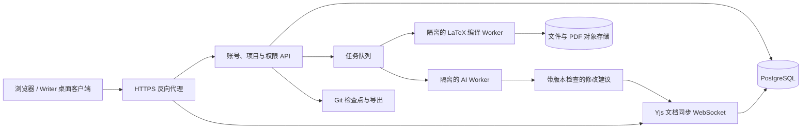

# Writer 服务器部署与多人协作调研

调研日期：2026-09-26。下文保留原始架构方案。2026-10-03 已新增可本机验证的单实例多人服务和 Docker 部署包，当前实际能力、启动方式及边界见 [文献库、修改审阅与多人协作](research-tools-and-collaboration.md)。这里的 PostgreSQL、多节点与完整 PDF 批注迁移仍属于后续方案。

## 结论

建议沿用 Writer 的 LaTeX 编辑器、PDF 阅读器、批注与三种 AI 后端，新增 Web 客户端和项目服务。桌面版继续保留，本地项目走现有 Tauri 接口，团队项目走 HTTPS / WebSocket。协作采用 CodeMirror 6 + Yjs，服务端可选 Hocuspocus。先做单机 Docker Compose 部署，稳定后再拆分服务。

当前 `apps/desktop` 是 Next.js 静态导出 + Tauri Rust 后端：读写文件、Git、编译、代理进程都通过 Tauri IPC 访问本机。`apps/web` 是介绍网站，不是多人编辑器。仓库虽有 yjs/y-protocols 依赖，目前没有文档同步 provider、多人编辑绑定或持久化服务。直接把 `.app`、静态 `out` 文件夹或共享磁盘放到服务器上，不能得到完整多人协作。

## 可部署的目标结构

- **客户端**：复用当前 CodeMirror、PDF 和聊天 UI，新增项目成员、在线光标、连接/保存状态。先把直接 `invoke(...)` 的文件、保存、编译、历史调用封装为可切换的数据接口。
- **项目 API**：管理用户、团队、项目成员、文件目录、评论、批注、AI 会话和编译任务。服务端检查项目权限，不只依赖界面隐藏按钮。
- **同步服务**：以项目 ID 和文档 ID 分房间。编辑器绑定 `Y.Text`；光标和在线状态使用 awareness，断线重连交换增量。Yjs 提供编辑器绑定与网络 provider 的分离结构；CodeMirror 6 有对应的官方组织绑定。[Yjs 协作编辑说明](https://docs.yjs.dev/getting-started/a-collaborative-editor)、[y-codemirror.next](https://github.com/yjs/y-codemirror.next)。
- **存储**：PostgreSQL 保存账号权限、评论状态、操作记录、文档更新和快照；图片、附件、PDF 进入 S3 兼容存储。初期一个服务实例即可，不必先引入多节点同步。Hocuspocus 提供认证、文档加载和保存 hooks，适合连接自有账号与数据库。[Hocuspocus hooks](https://tiptap.dev/docs/hocuspocus/server/hooks)。
- **编译/AI Worker**：每次使用指定项目的独立工作目录，和 Web/API 服务隔离；有 CPU、内存、时限和并发上限。编译产物不能覆盖其他项目，AI 进程不能读取其他用户的凭据。

## 多人共同编辑怎样实现

每个 `.tex/.bib/.md` 文档都有稳定文档 ID，改名只改目录元数据。客户端操作先写入 Yjs 文档，再同步到服务器和其他客户端。编辑器本地撤销只撤销本人操作，不能撤销同事的修改。图片等二进制文件采用上传新版本与引用更新，不做字符级合并。

需要区分三种提示：“本地已暂存”“服务器已确认保存”“离线待同步”。本地 IndexedDB 缓存不能代替服务端备份；服务端应在持久化成功后才确认保存。恢复时应组合更新日志与压缩快照，而不是只取进程退出前的文本。上线前必须实测同段并发插入、中文输入法、离线重连、服务重启恢复和多人撤销。

权限建议至少为：所有者、编辑者、批注者、只读者。邀请链接应限定项目、角色和有效期；成员撤权后也要断开已有文档连接。

## 多人批注与 PDF 怎样对齐

在现有批注基础上增加作者、回复线程、处理人、状态和版本关联。状态建议包含待处理、处理中、已解决、需重新定位；绿色“已解决”仍然保留讨论和修改依据。

源码批注不能仅保存第几行：协作编辑会移动行号。应保存 Yjs 相对位置的起止锚点、原文摘录和邻近文本；Yjs 相对位置可用于光标和评论范围，锚点无法恢复时要明确返回需重新定位。[Y.RelativePosition](https://docs.yjs.dev/api/relative-positions)。

PDF 批注至少绑定 `projectId + buildId + pdfHash + page + normalizedRects`，同时记录选中文字、对应源码文档 ID、源码相对锚点与编译版本。用户必须看到自己正在批注哪个编译版本。重新编译后：

1. 保留旧 PDF 与批注记录；不能把旧坐标直接涂到新 PDF。
2. 用同一编译快照的 SyncTeX 找源位置，再结合引用文字与邻近文本核对。
3. 只有映射可靠才迁移到新版；模糊、删除或结构改变的情况标为需重新定位。
4. 每次解决批注关联处理人、修改集和编译结果；保留“批注修改前”和“解决后”的 Git 检查点。

## 人与 AI 同时修改怎样避免覆盖

CRDT 能合并文本操作，但不能判断两个人或 AI 的改写在语义上是否冲突。AI 不应直接反复覆盖正在多人编辑的共享文件。

建议任务启动时捕获一个一致的项目快照，并为 AI 分配隔离工作目录。AI 返回补丁与所依据的文档版本；应用前验证原文/版本，未变化的范围可应用，冲突范围显示差异并请求处理。通过后，以一次带 AI 身份和任务 ID 的协作文档事务合入，所有客户端立即同步。批注也通过服务端任务 API 更新，避免旁路写文件造成状态不同步。

Codex、OpenCode、Claude Code 各有独立会话和工作进程，结果通过事件推送回界面，任务调度器记录结束和回信。多人环境需要把当前仅面向本机的会话桥接扩展为有账号身份、项目权限和审计记录的服务。

模型访问优先采用各用户自己的本地 Runner，或机构管理的 API 配置。不要把一份个人 `auth.json` 当作全组共享账号，也不要把 CLI 的原始控制端口直接开放到公网。组织级部署采用什么订阅/API 方式，需要单独确认相应供应商的支持方式。

## Git 与自动保存

实时协作文档是编辑时的事实来源，Git 是阶段性版本与导出记录。保留现有 15 分钟检查机制，但计时、去重和提交改为服务端按项目串行执行。有人手动保存版本、解决批注或完成 AI 修改后，更新项目检查点并重新计时。

一个检查点应该来自同一文档快照，包含当时的正文、参考文献、批注状态、编译目标配置和附件版本清单。记录参与者与 AI 任务 ID。恢复旧版时生成新的恢复事务，避免强制回滚正在编辑的其他用户页面。

## 未来部署步骤

这些步骤在服务端功能实现后执行，目前不是现成可运行的部署命令。

1. 准备 Linux 服务器、域名与 HTTPS；安装 Docker Engine / Compose，准备数据盘和备份位置。
2. 配置 Web、API、同步服务、PostgreSQL、对象存储，以及编译和 AI Worker。内部数据库/队列不直接对公网开放。
3. 固定 TeX Live/Tectonic 镜像、字体和宏包版本。沿用项目 `.writer/latex.json` 的多个编译目标和相对路径；每个任务按完整项目快照编译，输出使用唯一 buildId。
4. 创建管理员与团队，配置登录方式、项目角色、存储配额和并发限制。配置每位用户或组织的 AI 运行方式。
5. 导入项目，完成两名用户同时编辑、批注、断线恢复、权限撤销、AI 补丁冲突与备份恢复验收，再扩大使用范围。

小团队原型可以从一台 Linux 机器开始。作为工程估算，可先为 5–10 位在线编辑者准备 4–8 vCPU、16 GB 内存和 SSD；它不是实测容量承诺。真实资源主要取决于同时编译的项目数、图片规模和 AI 进程，编译并发先限制为 1–2，压测后调整。外部模型推理一般不要求服务器自带 GPU。

## 路线与替代方案

推荐顺序：先拆本地/远程接口及权限 → 双人同步编辑与可靠保存 → 多人批注和版本锚定 → 隔离编译与 AI 修改合入 → 审计、备份与部署工具。每一步都能单独验收，避免一次把所有桌面功能搬成共享进程。

若短期必须先有可用的多人 LaTeX 平台，可以单独评估 Overleaf 自托管作为过渡。官方 Toolkit 提供 Docker 部署流程；社区版和 Server Pro 的功能并不完全相同，官方将 comments、tracked changes 等列在 Server Pro 的附加功能中，不能假设免费社区版已包含想要的完整批注体验。[Overleaf Toolkit](https://github.com/overleaf/toolkit/blob/master/doc/quick-start-guide.md)、[版本介绍](https://docs.overleaf.com/on-premises/installation/introduction.md)。

对于你希望保留多种原生 AI 执行环境、PDF 批注驱动修改和批注 Git 追踪的方向，继续演进 Writer 更能保留已有工作流；代价是必须补齐协作存储、并发修改与权限隔离，不能只增加一个登录页面。
